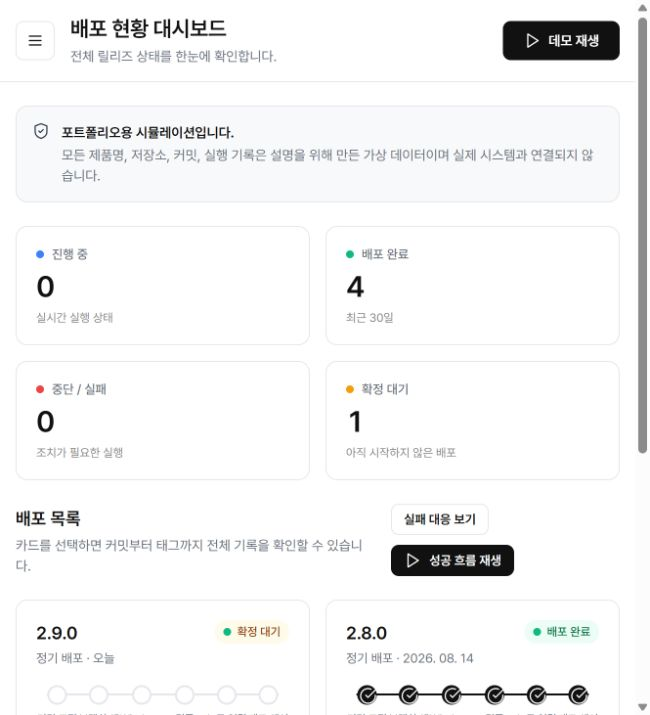

# Release Train Demo

여러 저장소의 커밋 확정부터 빌드 검증, 릴리즈 노트, 태그 생성까지 연결한 릴리즈 자동화 포트폴리오 데모입니다.

[데모 보기](https://jonghai.github.io/release-train-demo/)



## 데모에서 확인할 수 있는 흐름

- 모듈별 안정화 커밋 확정
- 프로젝트별 `release/<version>` 기준 구성
- Windows 빌드 및 산출물 검증 시뮬레이션
- 빌드 실패 알림과 수정 후 재빌드
- 배포 이력과 감사 로그
- 검토를 마친 릴리즈 노트

## 공개 안전성

이 저장소는 포트폴리오 설명을 위해 처음부터 새로 만든 정적 데모입니다. 회사 소스와 운영 데이터는 사용하지 않았습니다.

- 제품명과 저장소명은 모두 가상입니다.
- 커밋 해시와 실행 기록은 임의로 생성했습니다.
- 실제 API, 사내 네트워크, 인증 정보와 연결되지 않습니다.
- 모든 상호작용은 브라우저 메모리에서만 동작합니다.

## 실행

정적 파일이므로 `index.html`을 열거나 간단한 정적 서버로 실행할 수 있습니다.

```bash
python -m http.server 4173
```

## 기술

- HTML
- CSS
- JavaScript
- Simple Design System
- GitHub Pages

## 디자인 시스템

사용자가 제공한 Simple Design System의 Pretendard, 색상, 간격, 모서리, 상태 토큰을 사용했습니다.

Pretendard는 SIL Open Font License 1.1에 따라 배포됩니다. 자세한 내용은 `FONT-LICENSE.md`를 확인해 주세요.
