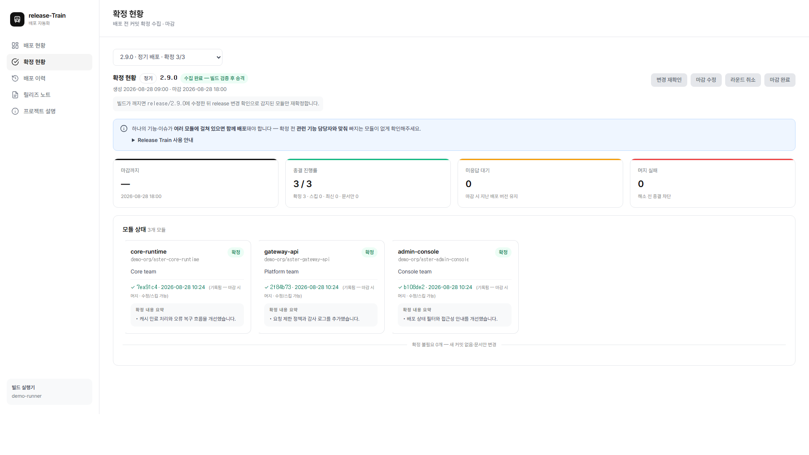
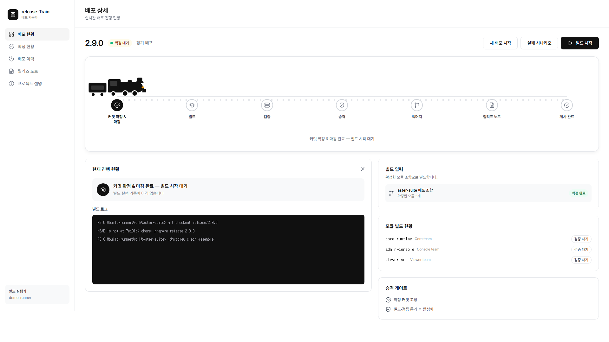
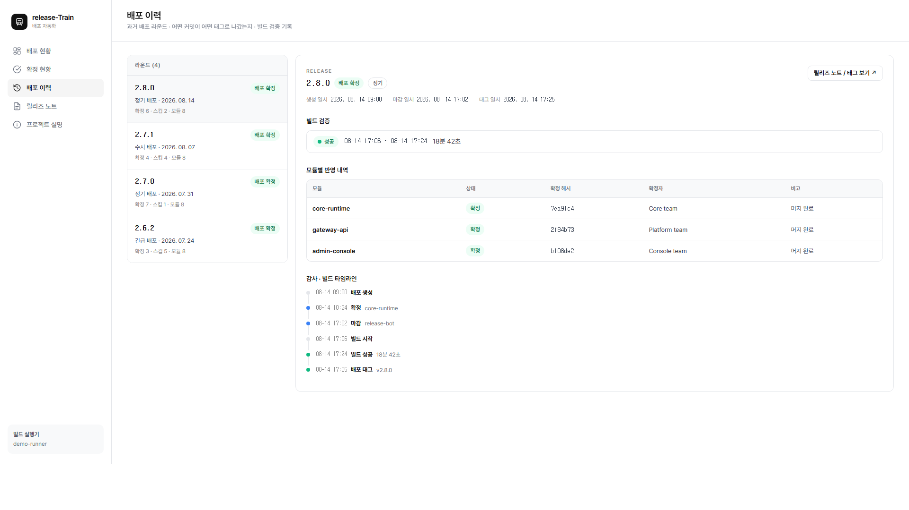
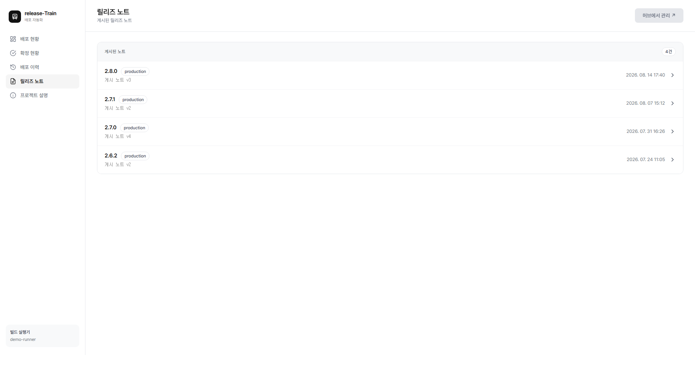

# Release Train Demo

여러 저장소의 커밋 확정부터 빌드 검증, 릴리즈 노트, 태그 생성까지 연결한 릴리즈 자동화 포트폴리오 데모입니다.

[데모 보기](https://jonghai.github.io/release-train-demo/)

[개발자 GitHub 프로필](https://github.com/JongHa11)


## 주요 화면

### 커밋 확정 현황

각 모듈 담당자가 이번 배포에 포함할 커밋을 확정하고, 전체 확정 상태를 함께 확인합니다.



### 배포 상세

빌드 실행 전 전체 배포 단계와 현재 상태를 기차 UI로 한눈에 확인합니다.



### 배포 이력

배포별 빌드 결과와 모듈 반영 내역, 주요 처리 시점을 한 화면에서 확인합니다.



### 릴리즈 노트

검토를 마친 릴리즈 노트를 버전별로 조회합니다.



## 데모에서 확인할 수 있는 흐름

- 모듈별 안정화 커밋 확정
- 새 배포 라운드 생성과 마감 시각 설정
- 선택한 커밋과 그 이전 커밋을 함께 포함하는 확정 경계 선택
- 확정 해시 기록, 마감 전 수정, 마감 시 일괄 머지의 분리
- 프로젝트별 `release/<version>` 기준 구성
- 여러 저장소의 배포 조합을 하나의 기준으로 고정
- Windows 빌드 및 산출물 검증 시뮬레이션
- 완성된 배포 산출물 목록과 다운로드 화면
- 빌드 실패 알림과 수정 후 재빌드
- 7개 배포 단계를 따라 움직이는 기관차 시각화
- 배포 이력과 감사 로그
- 검토를 마친 릴리즈 노트

## 공개 안전성

이 저장소는 포트폴리오 설명을 위해 처음부터 새로 만든 정적 데모입니다. 회사 소스와 운영 데이터는 사용하지 않았습니다.

- 제품명과 저장소명은 모두 가상입니다.
- 커밋 해시와 실행 기록은 임의로 생성했습니다.
- 실제 API, 사내 네트워크, 인증 정보와 연결되지 않습니다.
- 모든 상호작용은 브라우저 메모리에서만 동작합니다.

## 실행

정적 파일이므로 `index.html`을 열거나 간단한 정적 서버로 실행할 수 있습니다.

```bash
python -m http.server 4173
```

## 기술

- HTML
- CSS
- JavaScript
- GitHub Pages
